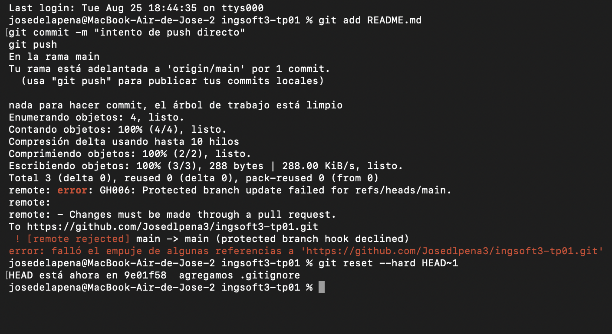
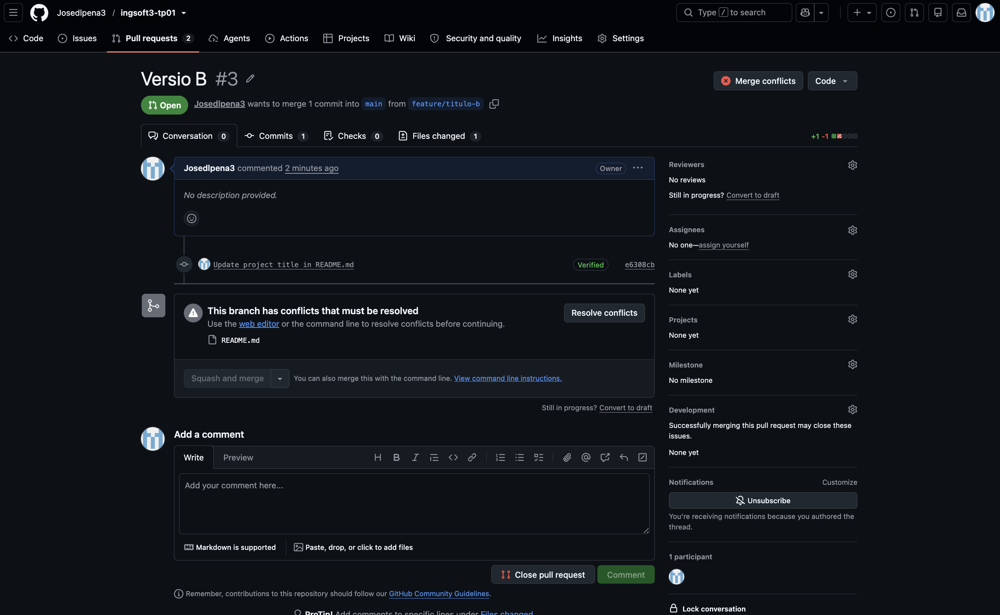
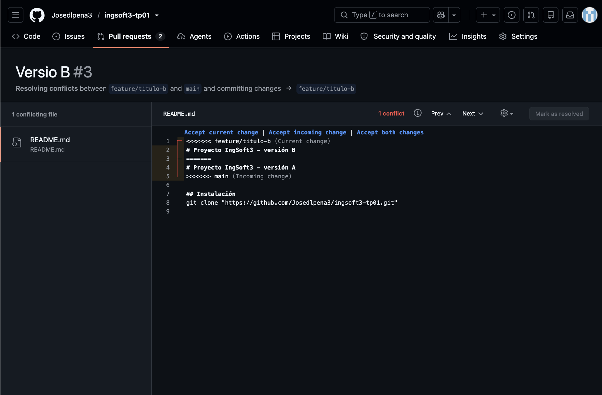
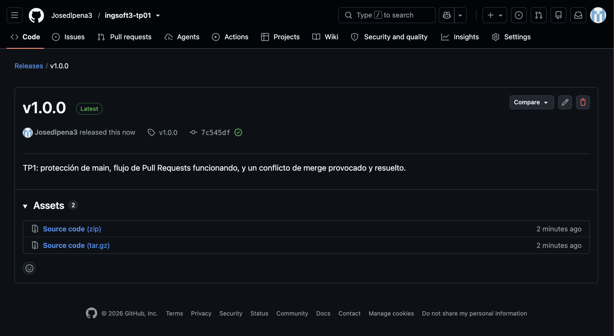

# Evidencias — TP1

## 1. Push directo a main rechazado

GitHub rechaza el push porque main está protegida y la regla alcanza también al dueño del repo.

## 2. El PR de la rama B no se puede mergear: conflicto

Ambas ramas modificaron la misma línea del README, así que GitHub no puede fusionar automáticamente.

## 3. Marcadores de conflicto en el editor de GitHub

Arriba de `=======` está la versión de la rama que se está mergeando (B); abajo, la que ya estaba en main (A).

## 4. Release v1.0.0 publicada

Primera versión estable del TP, tagueada con semver sobre main.

